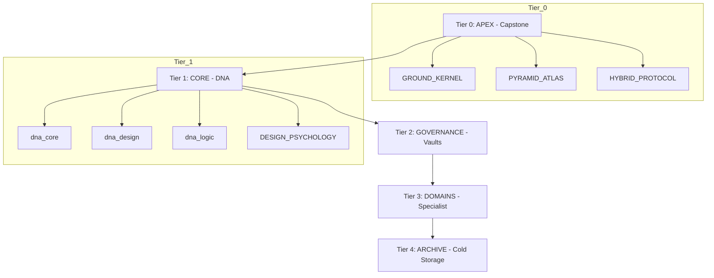

# 🧭 SOVEREIGN PYRAMID ATLAS (V15.2 APEX)

The master routing node for all Sovereign Intelligence, organized into a 5-tier hierarchy for maximum velocity and structural purity.

## 🧬 KNOWLEDGE TOPOLOGY

### 🛡️ TIER 0: APEX (Capstone)
- **kernel.dna**: [GROUND_KERNEL.md](file:///C:/Users/User/.gemini/antigravity/knowledge/0_apex/GROUND_KERNEL.md)
- **router.dna**: [PYRAMID_ATLAS.md](file:///C:/Users/User/.gemini/antigravity/knowledge/0_apex/PYRAMID_ATLAS.md)
- **format.dna**: [HYBRID_FORMAT_PROTOCOL.md](file:///C:/Users/User/.gemini/antigravity/knowledge/0_apex/HYBRID_FORMAT_PROTOCOL.md)

### 🧬 TIER 1: CORE (DNA)
- **dna.core**: [dna_core.md](file:///C:/Users/User/.gemini/antigravity/knowledge/1_core/dna_core.md)
- **dna.design**: [dna_design.md](file:///C:/Users/User/.gemini/antigravity/knowledge/1_core/dna_design.md)
- **dna.logic**: [dna_logic.md](file:///C:/Users/User/.gemini/antigravity/knowledge/1_core/dna_logic.md)
- **dna.arch**: [dna_arch.md](file:///C:/Users/User/.gemini/antigravity/knowledge/1_core/dna_arch.md)
- **dna.faucet**: [dna_faucet.md](file:///C:/Users/User/.gemini/antigravity/knowledge/1_core/dna_faucet.md)
- **dna.psych**: [DESIGN_PSYCHOLOGY_2026.yaml](file:///C:/Users/User/.gemini/antigravity/knowledge/1_core/DESIGN_PSYCHOLOGY_2026.yaml)

### 🏺 TIER 2: GOVERNANCE (Vaults)
- **node.governance**: [AOE_PROTOCOL.md](file:///C:/Users/User/.gemini/antigravity/knowledge/2_governance/AOE_PROTOCOL.md)
- **node.hud**: [APEX_HUD_LIBRARY.md](file:///C:/Users/User/.gemini/antigravity/knowledge/2_governance/APEX_HUD_LIBRARY.md)
- **vault.experience**: [experience_vault.md](file:///C:/Users/User/.gemini/antigravity/knowledge/2_governance/experience_vault.md)
- **vault.recall**: [singularity_recall.md](file:///C:/Users/User/.gemini/antigravity/knowledge/2_governance/singularity_recall.md)
- **vault.mastery**: [sovereign_framework_mastery.md](file:///C:/Users/User/.gemini/antigravity/knowledge/2_governance/sovereign_framework_mastery.md)

### ⚡ TIER 3: DOMAINS (Specialist)
- **mode.claude**: [3_domains/claude/](file:///C:/Users/User/.gemini/antigravity/knowledge/3_domains/claude/)
- **mode.faucet**: [3_domains/faucet/](file:///C:/Users/User/.gemini/antigravity/knowledge/3_domains/faucet/)
- **mode.normal**: [3_domains/normal/](file:///C:/Users/User/.gemini/antigravity/knowledge/3_domains/normal/)
- **mode.nanobrowser**: [C:/Users/User/OneDrive/Desktop/NanoBrowser/](file:///C:/Users/User/OneDrive/Desktop/NanoBrowser/)

### ❄️ TIER 4: ARCHIVE (Cold Storage)
- **archive.relics**: [4_archive/_relics/](file:///C:/Users/User/.gemini/antigravity/knowledge/4_archive/_relics/)
- **mode.openclaw**: [4_archive/domains/openclaw/](file:///C:/Users/User/.gemini/antigravity/knowledge/4_archive/domains/openclaw/) [🧊 STATUS: DORMANT]

## 🏗️ BUILD PIPELINE (JIT)
1. **Genesis**: `GROUND_KERNEL` + `PYRAMID_ATLAS`.
2. **Expansion**: Drill down into `1_core` for DNA Alignment.
3. **Execution**: Execute targeted Domain Logic from `3_domains`.

## 🔌 LOGIC GATES (Trigger Vectors)
- `prompt match [pyramid, skp, structure]`: Pull `PYRAMID_ATLAS.md`.
- `extension match [vue, ts]`: Pull `dna.logic` + `mode.claude`.
- `extension match [css, scss]`: Pull `dna.design` + `mode.normal`.
- `prompt match [harvest, faucet]`: Pull `mode.faucet`.
- `prompt match [onboarding, ux, psychology]`: Pull `dna.psych`.

---
**Sovereign Pyramid Atlas V15.2 — Aesthetic Standard (2026-04-19)**
