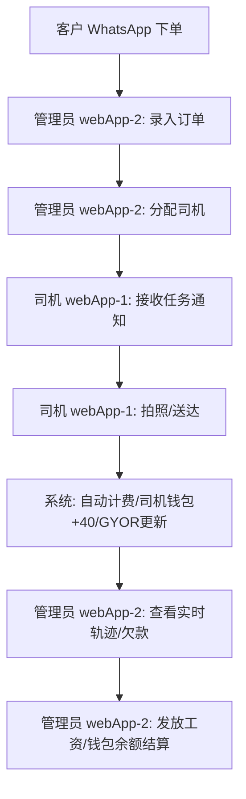

# 🗑️ SBLF: 垃圾桶管理与财务系统 (V1.1)

## 🎯 1. 项目概览 (PROJECT OVERVIEW)
**主题 (Topic)**: 工业垃圾桶租赁服务的高保真物流与欠款管理系统。
**使命 (Mission)**: 消除管理员、外勤物流（司机）与财务跟踪之间的运营摩擦。
**语言 (Language)**: **中文 (Chinese)** 为系统默认且唯一语言。

### 👥 1.1 核心角色 (Target Roles)
*   **管理员端 (Admin)**: 调度员、财务会计与车队经理。
*   **司机端 (Driver)**: 物流执行、工作证据提交（拍照）与报酬查看。

---

## 🏗️ 2. 系统架构 (SYSTEM ARCHITECTURE)

本系统采用 **“双 WebApp + 外部后台”** 的分体式架构，确保不同角色的极致体验与独立部署。

### 🧱 2.1 模块关系
1.  **外部后台 (Vben Admin Panel)**: 用于全局项目管理、数据库底层操作（仅作为参考，不参与本次 WebApp 核心开发）。
2.  **webApp-1 (司机专用端)**: 独立项目，部署于 `/driver/` 路径。专注任务执行与拍照。
3.  **webApp-2 (管理员移动端)**: 独立项目，部署于 `/admin-mobile/` 路径。专注实时监控与任务分发。

### ⚙️ 2.2 技术规格
*   **构建模式**: 独立 `npm run dev/build` 流程。
*   **资源共享**: 共享一套 CSS 样式变量与基础组件库，但 **Header/Footer 与权限验证逻辑完全独立**。
*   **部署环境**: cPanel 独立子目录部署。

### 🛠️ 2.3 技术选型与工具链 (TECH STACK)
*   **基础框架**: **Vue 3 (Composition API)** - 确保逻辑的高可维护性。
*   **样式方案**: **Tailwind CSS** - 用于极致的原子化样式控制与响应式适配。
*   **滑动组件**: **Swiper.js / Vue-Awesome-Swiper** - 用于司机端任务卡片的 Slideshow / Slider 效果。
*   **动画引擎**: **GSAP (GreenSock)** - 用于 GYOR 标记点与财务告警的平滑微动画。
*   **图标库**: **Lucide Vue Next** - 统一 2.0px 描边的深灰色工业图标。
*   **移动桥接**: **Capacitor** - 访问原生 Google Maps 导航、相机与 GPS。
*   **状态管理**: **Pinia** - 用于司机钱包余额与登录状态的实时同步。

---

## 🗺️ 3. 功能拆解 (FEATURE BREAKDOWN)

### 🟦 3.1 webApp-2: 管理员移动端 (Admin Mobile App)
*针对管理员在外办公、查看实时地图与下发任务设计。*

| 功能 (Feature) | 逻辑与需求 (Logic / Requirement) | 视觉标准 (Visual Standard) |
| :--- | :--- | :--- |
| **GYOR 大地图** | 实时查看所有小桶位置，颜色区分拖欠时长。 | 地图全屏覆盖 |
| **订单管理** | 接收 WhatsApp 订单后手动创建任务，记录 270/420 马币规格。 | 极速录入表单 |
| **实时行踪** | 追踪司机实时定位与历史行动轨迹。 | 动态轨迹线 (Dash line) |
| **欠款与还款** | 查看客户欠款列表，手动录入还款记录。 | 财务红色预警 |
| **工资操作** | 手动触发扣减司机钱包余额，完成工资发放闭环。 | 确认模态框 |

### 🟩 3.2 webApp-1: 司机专用端 (Driver Execution App)
*针对司机驾驶、现场操作与拍照存证设计。*

| 功能 (Feature) | 逻辑与需求 (Logic / Requirement) | 视觉标准 (Visual Standard) |
| :--- | :--- | :--- |
| **任务通知中心** | 接收管理员分配的任务详情（桶编号、地点）。 | 大文字卡片 |
| **一键导航** | 深度集成按钮，直接唤起手机 **Google Maps**。 | 固定底部导航栏 |
| **拍照存证** | 送达/送回公司双重拍照，自动关联订单。 | 全屏相机预览 |
| **工资钱包** | 查看每趟 40 马币报酬流水，掌握已发放与未发放余额。 | 金色钱包视图 |

---

## 🔄 3.3 核心业务流 (BUSINESS WORKFLOW)

---

## 🎨 4. 高级 UI/UX 与交互深度标准 (PREMIUM UX/UI)

### 💎 4.1 核心设计准则 (Design Philosophy)
*   **克制的大小调整**: 字体与组件不盲目追求“大”，而是追求 **“高对比度”** 与 **“充足间距”**。在普通规格基础上增加 10-15% 的触控面积。
*   **视觉层级 (Visual Hierarchy)**: 每一页只突出一个“黄金按钮”（主色调），次要操作采用幽灵按钮或灰色调，减少视觉干扰。
*   **触觉反馈 (Tactile Feel)**: 按钮加入物理深度阴影（Neumorphism 微调），让用户直观感到“可以按”。

### 🚚 4.2 webApp-1 (司机端) 体验深度挖掘
*   **单手操作优化**: 关键按钮（拍照、完成任务）置于底部 1/3 区域，方便单手大拇指触达。
*   **任务状态反馈**: 增加“已读”与“正在前往”状态，自动同步给管理员，减少沟通成本。
*   **极简卡片设计**: 任务列表不显示多余参数，仅显示：**编号 (大号字)**、**地点 (带图标)**、**距离 (高亮)**。

### 🟦 4.3 webApp-2 (管理员端) 体验深度挖掘
*   **地图呼吸感**: 地图标记点在缩放时自动聚合，防止视觉混乱。
*   **快捷拨号集成**: 点击司机头像或客户电话，直接唤起拨号，无需切换到 WhatsApp。
*   **财务红区逻辑**: 欠款超过设定天数的卡片，背景微显浅红色，营造一种“非侵入式”的催促感。

### ⚖️ 4.4 评分与专业度自检表 (UX Rating System)
| 维度 (Dimension) | 专业标准 (Professional Standard) | 自检目标 |
| :--- | :--- | :--- |
| **连贯性** | 从一个动作到下一个动作是否无需思考？ | 9/10 |
| **整洁度** | 页面是否能在 2 秒内找到最核心的信息？ | 10/10 |
| **舒适度** | 深色模式下的文字对比度是否在 4.5:1 以上？ | 9/10 |
| **容错性** | 关键操作（如发放工资、删除订单）是否有二次确认？ | 10/10 |

---

## 📊 5. 数据库架构 (DATA SCHEMA)
*   **`profiles`**: 用户资料，包括角色 (`admin`/`driver`) 和钱包余额 (`wallet_balance`)。
*   **`customers`**: 客户信息，包括联系方式和总欠款 (`total_debt`)。
*   **`bins`**: 垃圾桶信息，包括类型 (青色/蓝色)、位置坐标、状态 (在库/在客户处) 及最后操作时间。
*   **`orders`**: 订单记录，关联客户、桶、司机、类型 (送货/拉回) 和金额。
*   **`transactions`**: 交易流水，包括工资发放记录和客户还款记录。

---

## 🚀 5. 开发流程 (APP BUILDING FLOW - EVOLVING)
针对 **Gemini 3 Flash** 优化的自适应迭代协议：

1.  **[ ] 第一步：环境搭建**: 初始化 Vite + Tailwind + Capacitor。
2.  **[ ] 第二步：数据库部署**: 在 Supabase 中部署 SQL 表结构。
3.  **[ ] 第三步：认证系统**: 基于角色的登录与路由拦截。
4.  **[ ] 第四步：管理员基础界面**: 布局、菜单与主题配置。
5.  **[ ] 🔄 同步点 A**: 更新蓝图中的 UI 实现细节。
6.  **[ ] 第五步：GYOR 大地图**: 集成地图插件与动态标记。
7.  **[ ] 第六步：订单管理 UI**: 客户与垃圾桶订单 CRUD。
8.  **[ ] 第七步：司机任务逻辑**: 任务状态机实现。
9.  **[ ] 🔄 同步点 B**: 记录业务逻辑变动至蓝图。
10. **[ ] 第八步：拍照上传系统**: 存储桶与相机插件。
11. **[ ] 第九步：欠款计算引擎**: 超期提醒与账单统计。
12. **[ ] 第十步：工资与钱包同步**: 钱包扣减与流水记录。
13. **[ ] 第十一步：实时 GPS 追踪**: 位置上报功能。
14. **[ ] 第十二步：通知系统**: 消息提示逻辑。
15. **[ ] 第十三步：最终打磨与 PWA**: 图标生成与全屏配置。
16. **[ ] 🧬 进化点**: 将本项目设计 DNA 提取并同步至全局知识库。

---

## 🎨 6. 主题色彩战略攻略 (THEME COLOR STRATEGY V9.2)

### 🌿 6.1 核心调色盘 (Core Palette)
本方案基于 **"Stitch Clean & Professional"** 视觉规范，采用阶梯式位移算法生成。

| 角色 (Role) | 代码 (Hex) | 描述 (Description) |
| :--- | :--- | :--- |
| **主基色 (Primary)** | `#A8D5BA` | 核心浅绿色，用于品牌、成功状态、主按钮。 |
| **背景色 (Background)** | `#F7FAF8` | 极浅绿灰，替代纯白，减少视觉疲劳。 |
| **前景色 (Surface)** | `#FFFFFF` | 纯白卡片，用于内容容器，增加层级感。 |
| **文字/功能 (Ink)** | `#2D3436` | 深石墨灰，用于所有文本和关键图标。 |
| **辅助/边框 (Muted)** | `#DFE6E9` | 浅灰色，用于分割线与非激活状态。 |

### 📈 6.2 浅绿阶梯位移 (Green Tonal Scale)
*遵循 Sovereign +5%/10%/20% 协议：*
*   **Green-50 (Surface)**: `#F0F7F2` (用于页面大背景)
*   **Green-100 (Soft)**: `#E1EEE5` (用于卡片内阴影/提示背景)
*   **Green-200 (Border)**: `#C8E2D1` (用于精致的描边)
*   **Green-500 (Base)**: `#A8D5BA` (主色调)
*   **Green-600 (Hover)**: `#8FBC9F` (点击/悬停状态)
*   **Green-900 (Action)**: `#2F4F3F` (用于深色背景下的强对比文字)

### 🌊 6.3 渐变攻略 (Gradient Assets)
我们将使用 **"Stitch Fluid Gradients"** 增加现代感：
1.  **Eco-Glass (主要)**: `linear-gradient(135deg, #FFFFFF 0%, #F7FAF8 100%)` - 用于主卡片。
2.  **Vital-Green (功能)**: `linear-gradient(to right, #A8D5BA 0%, #C4E4D0 100%)` - 用于任务状态进度。
3.  **Misty-Edge (导航)**: `linear-gradient(to bottom, rgba(255,255,255,0.9), rgba(247,250,248,0.9))` - 用于顶部固定条。

### 🪄 6.4 Stitch 风格细则 (Stitch Style Guide)
*   **圆角 (Radius)**: 统一采用 `16px` (大型卡片) 与 `12px` (按钮)，营造亲和力。
*   **阴影 (Shadows)**: 禁用 `box-shadow: black`。使用 `box-shadow: 0 10px 30px rgba(168, 213, 186, 0.15)` (带色相的软阴影)。
*   **图标 (Icons)**: 统一采用 **2.0px Stroke 线条图标**，深灰色填充，避免过于厚重。

---

---

## 🛡️ 8. 架构合规与安全协议 (COMPLIANCE & AOE)

本蓝图严格遵循 **Sovereign Apex (V15.2)** 安全与执行标准：

*   **执行准则 (APEX 1 & 3)**: 每一阶段代码提交前，必须进行 **Surgical Intent (手术意图)** 说明，并执行 `npm run lint` 烟雾测试。
*   **数据隔离 (AOE Tier-1)**: 
    *   **管理员端 (Tier-1)**: 涉及工资发放与还款录入，强制执行 **Plan-Stop-Approve** 手动确认流程。
    *   **司机端 (Tier-2)**: 涉及拍照上传，采用 **Shadow Drafting (影子草案)** 逻辑，确保照片元数据不泄露。
*   **权限分级**: 严格执行 **SBAC (Supabase Role-Based Access Control)**，在数据库层面物理阻断司机读取管理员财务表的可能性。

---

## 🪄 9. 专项设计咒语 (DESIGN SPELLS)

为了达到 **Stitch 级别** 的极致质感，我们将部署以下设计咒语：

1.  **Spell: Glass Hover (玻璃悬浮)**: 鼠标/手指悬浮于任务卡片时，卡片产生 `backdrop-filter: blur(20px)` 增强感，并伴随 `scale(1.02)` 的缓动。
2.  **Spell: Pulse Ping (脉冲侦测)**: 地图上的 GYOR 红色标记点（严重超时）会伴随周期性的透明度脉冲动画，产生视觉上的“求救感”。
3.  **Spell: Haptic Success (触感反馈)**: 订单成功创建或照片上传成功时，移动端调用 `Capacitor.Haptics` 触发短促的两次震动（Success vibe）。
4.  **Spell: Liquid Transition (流体切换)**: 页面切换采用 **Framer Motion** 的 `opacity` 渐变 + `y` 轴位移，消除硬切的生硬感。

---

## 🔄 11. 持续进化与同步协议 (EVOLUTION PROTOCOL)

为了确保 **Blueprint**、**Code** 与 **.gemini Knowledge** 的三位一体，执行以下协议：

1.  **实时映射 (Real-time Sync)**: 每次对话中产生的 UI 设计优化或业务逻辑变动，AI 必须在当前 turn 或下一个 turn 及时更新 `APP_BLUEPRINT.md`，确保其始终是“活的”说明书。
2.  **偏差检测 (Drift Detection)**: 开发每一页前，必须对照蓝图中的 **“专项设计咒语 (Section 9)”**。如果代码实现与蓝图不符，必须先修正蓝图或说明偏差理由。
3.  **知识反哺 (Global Up-link)**: 当本项目产生具有普适价值的创新（如：GYOR 优化算法、Stitch 阶梯配色实践）时，AI 应主动建议将其整理并存入 `.gemini/knowledge` 的 `1_core` 或 `2_governance` 中。
4.  **审美自进化**: 随着开发深入，蓝图中的 **“UX Rating System (Section 4.4)”** 将根据用户反馈实时调高标准，推动 UI 向更专业、更精美的方向演进。

---

## 🗒️ 12. 决策日志与假设 (DECISION LOG)
*   **假设 1**: 司机端优先适配安卓设备，需具备 Google Play 服务以运行谷歌地图。
*   **假设 2**: 系统全中文环境，涉及的 MYR 货币单位统一显示为 "马币"。
*   **决策 1**: 采用 "钱包" 模式管理司机报酬，管理员一键发放，系统自动结算余额。
*   **决策 2**: 采用 **“双 WebApp 独立架构”**，webApp-1 (司机) 与 webApp-2 (管理员) 物理隔离，独立部署于不同路径。

---

## 🧠 13. AI 推理与执行准则 (AI REASONING & EXECUTION)

本项目开发严格遵循 **Karpathy Operational Standard (V15.2)**，确保逻辑的高保真与代码的极简性：

1.  **思考优先 (Think Before Coding)**: 遵循 **APEX 2**，在生成任何代码前，AI 必须先在内部执行“逻辑级联检查”，验证新功能是否会破坏现有的 **双 WebApp 架构**。
2.  **手术级手术 (Grep-First Surgery)**: 遵循 **APEX 3**，所有 UI 微调必须精确定位 CSS 变量或组件 Props，杜绝大面积重写，保持代码库的“干燥 (DRY)”。
3.  **微验证驱动 (Micro-Verification)**: 遵循 **APEX 1**，每完成一个页面（如订单创建页），必须立即进行交互流验证，确保按钮连贯、路由无死角。
4.  **目标导向的设计 (Goal-Driven)**: 拒绝 Speculative Coding（猜测性编程）。所有设计方案（如：阶梯色位移）必须服务于 **“高龄用户舒适度”** 这一核心目标。
5.  **HUD 视觉标准**: 所有输出必须符合 **Sovereign HUD** 标准，保持临床级的整洁与专业感。

---
*Created by Antigravity (V9 Predictive Engine)*
